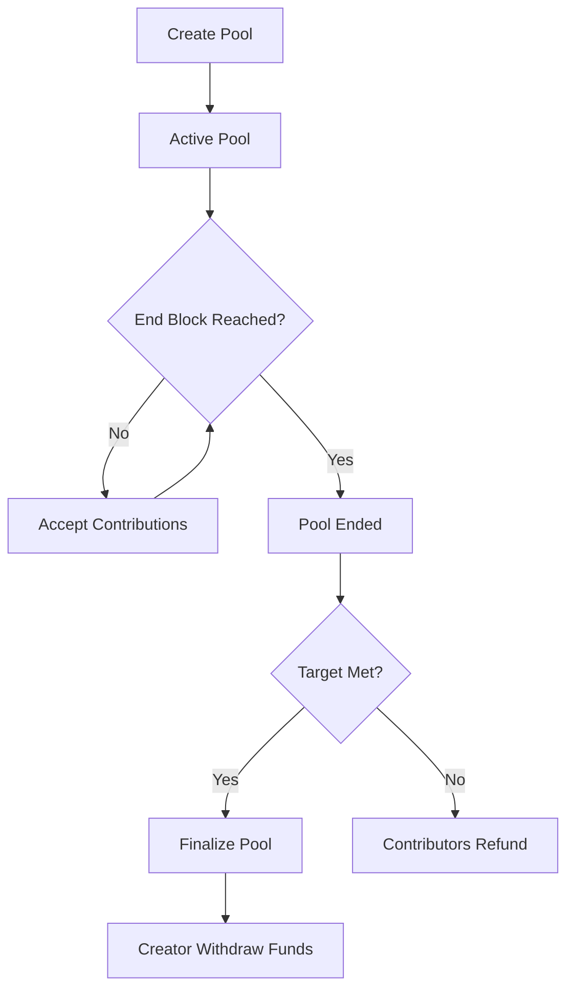

# 🌍 Diaspool - Diaspora Investment Pools

> **Contribute to homeland projects on-chain** 🚀

Diaspool is a decentralized platform built on Stacks that enables diaspora communities to create and fund investment pools for projects in their homeland. Pool creators can raise funds for development projects, while contributors can support meaningful initiatives and potentially receive returns.

## ✨ Features

- 🏗️ **Create Investment Pools** - Launch funding campaigns for homeland projects
- 💰 **Contribute Securely** - Fund projects with STX tokens on-chain  
- ⏰ **Time-Based Pools** - Set funding deadlines with automatic finalization
- 🔄 **Refund Protection** - Get refunds if pools don't meet targets
- 📊 **Real-time Tracking** - Monitor pool progress and contribution stats
- 💼 **Platform Fees** - Sustainable model with configurable platform fees

## 🚀 Quick Start

### For Pool Creators

1. **Create a Pool**
   ```clarity
   (contract-call? .diaspool create-pool 
     "Solar Farm Project" 
     "Building renewable energy infrastructure in rural areas"
     u1000000  ; Target: 1M STX  
     u144      ; Duration: ~1 day
   )
   ```

2. **Finalize Pool** (after end block)
   ```clarity
   (contract-call? .diaspool finalize-pool u1)
   ```

3. **Withdraw Funds**
   ```clarity
   (contract-call? .diaspool withdraw-funds u1)
   ```

### For Contributors

1. **Contribute to Pool**
   ```clarity
   (contract-call? .diaspool contribute-to-pool u1 u50000)  ; Contribute 50K STX
   ```

2. **Check Pool Status**
   ```clarity
   (contract-call? .diaspool get-pool-progress u1)
   ```

3. **Request Refund** (if pool fails)
   ```clarity
   (contract-call? .diaspool refund-contribution u1)
   ```

## 📋 Contract Functions

### Public Functions

| Function | Description | Parameters |
|----------|-------------|------------|
| `create-pool` | Create new investment pool | title, description, target-amount, duration-blocks |
| `contribute-to-pool` | Contribute STX to pool | pool-id, amount |
| `finalize-pool` | Mark pool as completed | pool-id |
| `withdraw-funds` | Creator withdraws raised funds | pool-id |
| `refund-contribution` | Get refund from failed pool | pool-id |
| `cancel-pool` | Creator cancels active pool | pool-id |

### Read-Only Functions

| Function | Description | Parameters |
|----------|-------------|------------|
| `get-pool` | Get pool details | pool-id |
| `get-contribution` | Get user's contribution | pool-id, contributor |
| `get-pool-progress` | Get pool funding progress | pool-id |
| `is-pool-active` | Check if pool is active | pool-id |

## 🏗️ Pool Lifecycle



## 💡 Usage Examples

### 🏥 Healthcare Project
```clarity
;; Create pool for medical clinic
(contract-call? .diaspool create-pool 
  "Rural Medical Clinic"
  "Establishing primary healthcare facility in underserved region"
  u5000000    ; 5M STX target
  u1008       ; ~1 week duration
)
```

### 🎓 Education Initiative  
```clarity
;; Create pool for school infrastructure
(contract-call? .diaspool create-pool
  "Digital Learning Center" 
  "Computer lab and internet connectivity for local schools"
  u2500000    ; 2.5M STX target
  u2016       ; ~2 weeks duration
)
```

## ⚙️ Configuration

- **Platform Fee**: 2.5% (250 basis points) - configurable by contract owner
- **Minimum Pool Duration**: 1 block
- **Maximum Title Length**: 100 characters
- **Maximum Description Length**: 500 characters

## 🔒 Security Features

- ✅ Pool creator authorization checks
- ✅ Time-based pool expiration  
- ✅ Double-spend protection
- ✅ Withdrawal state management
- ✅ Refund safety mechanisms

## 🧪 Testing

Run the test suite with:
```bash
clarinet test
```

## 📝 License

MIT License - Build the future of diaspora investment! 🌟

## 🤝 Contributing

We welcome contributions! Please feel free to submit a Pull Request.

---